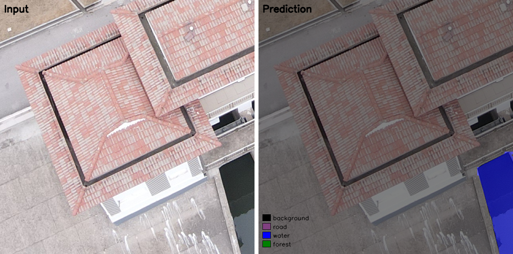
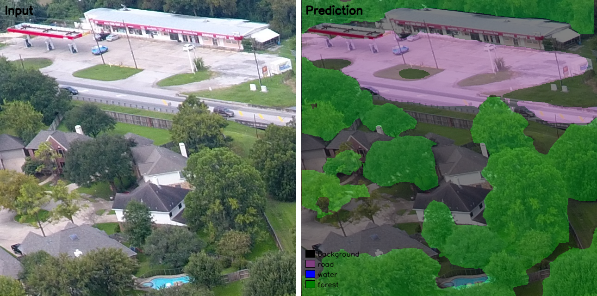
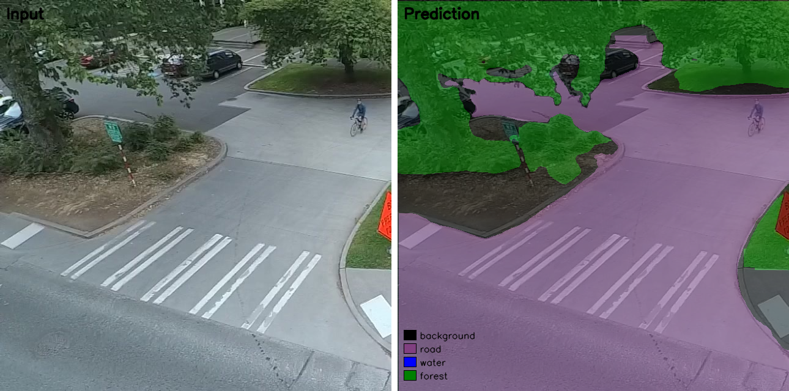

# YOLOE Aerial Segmentation

Linear probing of [YOLOE](https://docs.ultralytics.com/models/yoloe/) (language-enabled segmentation) on 5 open-source drone aerial datasets, unified into 4 semantic classes: background, road, water, and forest.





---

## Datasets

| Dataset | Source |
|---|---|
| Aeroscapes | [DatasetNinja](https://datasetninja.com/aeroscapes) |
| UAVid | [DatasetNinja](https://datasetninja.com/uavid) |
| FloodNet | [GitHub – BinaLab/FloodNet-Supervised\_v1.0](https://github.com/BinaLab/FloodNet-Supervised_v1.0) |
| VDD (Vehicle Detection in Diverse Weather) | [GitHub – RussRobin/VDD](https://github.com/RussRobin/VDD) |
| Semantic Drone | [Kaggle – semantic-drone-dataset](https://www.kaggle.com/datasets/nunenuh/semantic-drone) |

### Why these five datasets?

Each captures different urban/rural aerial conditions — diverse lighting, weather, geography, and camera angles. Combining them improves generalization and prevents overfitting to any single dataset's annotation style or environmental bias.

### Why four classes (background, road, water, forest)?

These are the only semantic classes present across **all** five datasets after harmonization. Each dataset has its own label taxonomy:

- **Aeroscapes**: road, vegetation → mapped to road, forest
- **UAVid**: road, tree, low vegetation → mapped to road, forest
- **FloodNet**: 10 original classes (background types, road sub-types, water, forest) → collapsed to 4
- **VDD**: 7 original classes (background, road, forest, water, etc.) → collapsed to 4
- **Semantic Drone**: paved-area, dirt, gravel → road; water, pool → water; vegetation, tree, bald-tree → forest

This intersection ensures every dataset contributes to every foreground class, maximizing usable training data.

---

## Pipeline

### 1. `src/config.py` — Central configuration

Defines absolute paths to raw datasets, harmonized output directories, and per-dataset class-to-unified mapping dictionaries. `UNIFIED_NAMES` maps semantic IDs to human-readable names. Each dataset's mapping (`AERO_UNIFIED`, `FLOODNET_UNIFIED`, etc.) specifies how original class IDs/labels map to the unified 4-class scheme. `DATASET_SPLITS` lists the subdirectory structure for each dataset's train/val/test partitions — needed because every dataset uses a different folder layout.

### 2. `src/converters.py` — Dataset-specific mask conversion

Each dataset stores annotations in a different format:

- **Aeroscapes & UAVid**: JSON with base64-encoded zlib-compressed bitmap masks. `convert_json_bitmap` decodes the bitmap, decompresses, and overlays each object onto a canvas using `classTitle` → unified ID mapping. Tracks pixel overlap count to warn about conflicting annotations.
- **FloodNet**: Single-channel PNG masks with class-index pixels. Simple remap via `FLOODNET_UNIFIED` dict.
- **VDD**: Single-channel PNG with 7 class indices. Remapped similarly.
- **Semantic Drone**: RGB PNG masks where color encodes the class. `convert_semdrone_mask` builds a 256³ LUT (lookup table) indexed by `(B << 16 | G << 8 | R)` for O(1) pixel remapping — critical because the naive approach (per-pixel dict lookup) would be prohibitively slow on large aerial images.

`save_mask` writes the unified mask as a single-channel PNG. `decode_bitmap` handles the common DatasetNinja bitmap format shared by Aeroscapes and UAVid.

### 3. `src/batch_convert.py` — Batch conversion driver

Iterates `DATASET_SPLITS` and processes each dataset's splits. For each source image, it finds the corresponding annotation file (JSON for Aeroscapes/UAVid, PNG for others), calls the appropriate converter, and saves the unified mask to `harmonized/masks/`. Generates `harmonized/manifest.csv` linking each mask to its dataset, split, and source image path.

**Idempotency**: Skips already-converted masks by checking filename presence, allowing safe re-runs after interruptions.

### 4. `src/preprocess.py` — Crop generation

Reads `harmonized/manifest.csv` and grids each source image into 640×640 non-overlapping tiles (stride = 640). Each tile is saved as a JPEG image + PNG mask pair in `crops/images/` and `crops/masks/`.

**Why 640×640 with stride=640?**
- 640 is standard input size for YOLO models, balancing detail and memory.
- Non-overlapping stride ensures every pixel belongs to exactly one crop — no data duplication, no risk of identical pixels leaking across train/val/test.

**Why source-image-level split (not crop-level)?**
Assigns each source image's crops entirely to train, val, or test before cropping. If we shuffled crops from the same source image across splits, nearby crops would be nearly identical (differing only by offset), causing train/val/test leakage. This would inflate metrics and mask poor generalization. The 75/15/10 ratio allocates crops accordingly: 75% of non-test source images → train, 15% → val, the remaining 10% → test. Any source image already designated "test" by its original dataset stays in test.

The final `crops/manifest.csv` records every crop's source, offset, dimensions, and split assignment. `crops/split.json` summarizes the final distribution.

### 5. `src/polygons.py` — Mask to YOLO polygon conversion

Converts pixel-perfect ground-truth masks to YOLO-format polygon labels. For each foreground class:

1. Extracts a binary mask for that class.
2. Optionally applies morphological closing (forest only, kernel=5) — forest regions in aerial masks often have fine holes from individual trees; closing merges nearby fragments into coherent polygons.
3. Runs connected components to separate distinct instances.
4. Filters by minimum area to remove noise: road ≥ 16 px², water ≥ 16 px², forest ≥ 100 px². Forest uses a higher threshold because its regions are naturally large and contiguous.
5. Approximates each component's contour with Douglas-Peucker (`epsilon = 0.001 × perimeter`) to reduce vertex count while preserving shape fidelity.
6. Normalizes coordinates to [0, 1] relative to image dimensions.

Returns a list of YOLO-format lines: `<class_id> x1 y1 x2 y2 ...`

**Why connected components + polygon approximation instead of simply encoding every pixel?**
YOLO requires polygon labels, not per-pixel masks. Connected components decompose a single raster mask into distinct object instances. Polygon approximation compresses contour data, reducing label file size and training I/O overhead.

### 6. `src/generate_labels.py` — YOLO dataset assembly

Reads `crops/manifest.csv`, processes all train/val crops:

1. Runs a pre-check on 20 random masks to verify polygon quality and class balance. If one class dominates >10× others, it flags potential fragmentation issues.
2. For each crop: converts mask to YOLO polygons via `mask_to_polygons`, writes `finetune/labels/{split}/{crop_id}.txt`, copies the JPEG image to `finetune/images/{split}/`.
3. Generates `finetune/data.yaml` — the Ultralytics dataset descriptor pointing to train/val image directories and class names (road, water, forest).

### 7. `src/run_finetune.py` — Linear probe training

Loads the pretrained YOLOE-v8s-seg checkpoint and trains only the classification head while freezing backbone, neck, and detection box head. This is **linear probing**: adapting the language-aligned text embeddings to target domain classes without modifying the pretrained visual encoder. Key parameters:

- **batch=12**: Maximum that fits RTX 4070 (8 GB VRAM) with 640×640 inputs.
- **augment=True**: Standard Ultralytics augmentation (mosaic, flips, etc.) improves generalization.
- **freeze=['backbone', 'neck', 'detection']**: Only the classification head parameters are updated (~13% of total).
- **trainer=YOLOEPESegTrainer**: YOLOE-specific trainer that handles the language-prompted segmentation head.

After training, saves a parameter audit comparing trainable vs total parameters and exports the model to `checkpoints/linear_probe_10ep.pt`.

**Why linear probing instead of full fine-tuning?**
YOLOE's text encoder is pretrained on aligned image-text pairs. Freezing the visual backbone preserves these representations while adapting the classification head to the 4-class target domain. This reduces overfitting risk (the datasets are small relative to pretraining data) and training time. Full fine-tuning would risk catastrophic forgetting of the language-aligned features.

### 8. `src/resume_finetune.py` — Resume training to 30 epochs

Loads the 10-epoch checkpoint and continues training with `resume=True` (Ultralytics auto-detects the last completed epoch from `results.csv` and the project directory). Trains to 30 total epochs, saving the final model to `checkpoints/linear_probe_30ep.pt`.

**Why resume instead of a single 30-epoch run?** Training time exceeded the 2-hour shell timeout. Resuming from the last checkpoint is seamless with Ultralytics' `resume=True` — it reads the original `args.yaml` and continues from the saved optimizer state.

### 9. `eval_all.py` — Zero-shot evaluation

Evaluates the pretrained YOLOE-26s-seg model (no fine-tuning) on the test set. Uses **optimized prompts** (`'road street highway asphalt concrete'`, `'water river lake sea ocean'`, `'forest trees woodland jungle'`) instead of bare class names — these multi-word prompts produce better text embeddings for the aerial domain, boosting detection rates. Uses `retina_masks=True` for proper YOLOE zero-shot mask decoding and a low confidence threshold (`conf=0.10`) because the domain gap between YOLOE's training data (ground-level) and aerial imagery causes low-confidence predictions.

**Why conf=0.10?** At conf=0.25, zero-shot detects only ~53% of test images. Lowering to 0.10 captures more predictions but increases false positives (background IoU drops from 0.614→0.314).

Processes 100-image mini-batches with streaming inference to avoid OOM on the 8 GB GPU. Computes pixel-level mIoU and per-class IoU against ground truth masks. Results saved to `results/test_eval_metrics.json`.

### 10. `eval_trained.py` — Trained model evaluation

Same structure as `eval_all.py` but for fine-tuned models. Uses `retina_masks=False` (standard segmentation head), `conf=0.25` (standard for trained models), and `batch=16` (much faster without retina decoding). Accepts checkpoint path as argument. Results saved to `results/test_{checkpoint_stem}_eval_metrics.json`.

### 11. `predict.py` — Single-image inference

Loads a trained model and runs inference on a single image. Maps YOLO class predictions (0=road, 1=water, 2=forest) to 4-class semantic IDs, overlays color-coded masks (black=background, purple=road, blue=water, green=forest), and displays the blended result.

---

## Models

| Checkpoint | Description |
|---|---|
| `checkpoints/linear_probe_10ep.pt` | Fine-tuned for 10 epochs |
| `checkpoints/linear_probe_30ep.pt` | Fine-tuned for 30 epochs |
| `yoloe-26s-seg.pt` | Pretrained zero-shot model (auto-downloaded) |
| `yoloe-v8s-seg.pt` | Base model for fine-tuning (auto-downloaded) |

### Training Configuration

- **Framework**: Ultralytics YOLOE (`YOLOEPESegTrainer`)
- **Frozen layers**: backbone, neck, detection head
- **Trainable**: classification head only (~13% of parameters)
- **Batch**: 12 | **Image size**: 640×640 | **Epochs**: 10 / 30
- **Augmentation**: Standard Ultralytics (mosaic, flips, HSV jitter)
- **Hardware**: NVIDIA RTX 4070 (8 GB VRAM)

---

## Results

All metrics computed on the held-out test set (23,500 crops, 640×640) as dense pixel-wise predictions with winner-takes-all label assignment (overlapping predictions resolved by confidence order).

### From instance to semantic segmentation

YOLOE is an instance segmentation model — it detects individual objects and assigns each a mask and class label. To evaluate it as a **semantic** segmentation model (every pixel gets a class, no instance distinction), each predicted instance mask is painted onto a class-level canvas. When multiple instances of the same or different classes overlap, the highest-confidence prediction wins. This produces a dense class map that can be compared pixel-by-pixel against ground truth masks. The mIoU and pixel accuracy metrics in this report follow this protocol, treating all instances of the same class as a single semantic region.

| Method | mIoU | Pixel Acc. | Background | Road | Water | Forest |
|---|---|---|---|---|---|---|
| Zero-shot (conf=0.10) | 0.219 | 0.413 | 0.314 | 0.217 | 0.104 | 0.240 |
| Linear Probe (10 ep, conf=0.25) | 0.673 | 0.833 | 0.771 | 0.658 | 0.631 | 0.633 |
| Linear Probe (30 ep, conf=0.25) | **0.701** | **0.849** | **0.791** | **0.681** | **0.681** | **0.650** |

### Key Takeaways

- Linear probing improves mIoU by **3.2×** over zero-shot (0.701 vs 0.219).
- Extending from 10→30 epochs yields a modest +4.1% relative gain — most benefit is captured by epoch 10.
- Water is the hardest class in zero-shot (IoU=0.104) due to diverse aerial appearances (rivers, pools, flooded areas, reflections). Fine-tuning brings it to 0.681.
- Forest benefits most from extended training, as its larger regions require more iterations to learn boundary details.
- Zero-shot is poorly calibrated for the aerial domain. At conf=0.25, most predictions are filtered out. Lowering to 0.10 recovers detections but introduces false positives.

---

## Usage

```python
from ultralytics import YOLOE

model = YOLOE('checkpoints/linear_probe_30ep.pt')
model.set_classes(['road', 'water', 'forest'], model.get_text_pe(['road', 'water', 'forest']))

results = model.predict('image.jpg', conf=0.25)
```

### Command-line evaluation

```bash
# Zero-shot evaluation
python eval_all.py

# Trained model evaluation
python eval_trained.py checkpoints/linear_probe_30ep.pt

# Single-image inference
python predict.py
```

---

## Project Structure

```
├── src/                          # Training and data processing
│   ├── config.py                 # Paths and class mappings
│   ├── converters.py             # Dataset-specific mask converters
│   ├── batch_convert.py          # Batch conversion driver
│   ├── preprocess.py             # Crop generation + split assignment
│   ├── polygons.py               # Pixel mask → YOLO polygon conversion
│   ├── generate_labels.py        # YOLO dataset assembly
│   ├── run_finetune.py           # Linear probe training (10 epochs)
│   └── resume_finetune.py        # Resume training (10 → 30 epochs)
├── finetune/                     # Training data (YOLO format)
│   ├── data.yaml                 # Ultralytics dataset config
│   ├── images/train/             # Training images
│   ├── images/val/               # Validation images
│   ├── labels/train/             # YOLO polygon labels (train)
│   └── labels/val/               # YOLO polygon labels (val)
├── crops/                        # Processed 640×640 crops
│   ├── manifest.csv              # Crop-to-source mapping + split
│   └── split.json                # Split distribution summary
├── harmonized/                   # Intermediate unified masks
├── checkpoints/                  # Trained model weights
├── results/                      # Evaluation metrics and report
├── eval_all.py                   # Zero-shot evaluation
├── eval_trained.py               # Trained model evaluation
├── predict.py                    # Single-image inference
└── README.md
```

## Requirements

- Python 3.10+
- PyTorch 2.0+
- ultralytics >= 8.4.81
- OpenCV, NumPy, Pandas, Pillow
